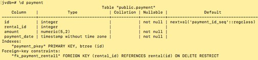
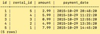

**Preface** 
****
This was a final project from an undergraduate course in relational database design and PostgreSQL.
I utilized MySQL Workbench for a majority of the DDL, as well as for conceptual modeling to produce the ERD.
I modified the create script from the forward engineer from MySQL to utilize PostgreSQL 
datatype serial for primary keys. The forward engineer from MySQL workbench was significantly more readable than the data dump from psql.
Conversely, data entry and generating insert statements was more fluid with PgAdmin.
Full Schema including Inserts are included in the SQL file. Some details have been removed to prevent plagarism.
The project essentially consisted of creating the operational database schema, and then demonstrating it via screenshots.
****
**Video Store DB**
****
Given a brief summary of the Small Business Video Store business operation, a
task was assigned to develop a PostgreSQL database to automate record
keeping of inventory and business transactions. The final structure of
the database consists of fourteen entity tables and four
association tables required to achieve many-to-many relationships. All
tables were then successfully populated with an adequate quantity of
sample data required to meet testing requirements, ensuring that all
business operations were supported.

The database life cycle describes the stages involved in development of
an implementation of a database. The process begins by gathering
business requirements by examining the provided summary.
Entities, attributes, and relationships were discovered, and
relationship sentence pairs were developed.

Figure 1 – Entity Relationship Diagram of Johnson Video Store Database.

The field of conceptual modeling began nearly forty-years ago and
continues to evolve, but Chen’s seminal paper delivered the entity
relationship model that has become virtually synonymous with database
design (Storey,
Trujillo, & Liddle, 2015). Conceptual Data Modeling can be performed to
produce an Entity Relationship Diagram (ERD). Depicted in Figure 1, the
Johnson Video Store Database ERD describes all the entities (rectangles)
and relationships (lines) discovered while gathering business
requirements. Attributes or fields are also enumerated with an
appropriate chosen datatype; primary and foreign keys are also shown.
Entities housing foreign keys of child entities may be referred to as
the owning entity. Dotted lines were used to indicated non-mandatory
relationships, conversely solid lines represent mandatory or defining
relationships. For example, the lines between movie\_has\_category,
indicates in order for the relationship to exist, foreign keys are
required to be present from both the movie and category entities.

The next phase in the design process is the conversion of the ERD to a
logical design by constructing tables, columns, primary keys, foreign
keys and their constraints. Normalization also occurs during this phase,
removing any redundancies producing. During this phase, a decision was
made to factor out address details from the customer, staff, and
distributor tables into an additional address table. This prevented
repetition of attributes in aforenoted entities and promoted flexibility
for any evolution that might be required by unanticipated future
business requirements.

The third phase, the distributed design phase, is virtually non-existent
with regards to this project as it is small in scope and not
distributed.  However, this phase
would have been more apparent had the business had multiple stores. The
design is normalized to the extent that a future implementation
supporting a store entity could be related to the staff table with the
insertion of a foreign key store id. There would be virtually no effect
upon any of the other data structures.

The final phase, the physical database design, also does not have much
to elaborate upon. Additional indexes were not warranted beyond the
default generated by PostGRES for primary keys. With regards to concern
for performance, in terms of response time, while hard to measure, it is
unlikely that multiple users will be performing operations on the system
concurrently. In terms of conservation of disk space, there is very
little redundancy. Because the data was already well normalized during
the conceptual modeling phase, few adjustments were made. However, a
missed requirement was discovered during data population, and required
the addition of the account number attribute in the customer entity

**Data Definition Language (DDL) Output**
****

Figure 2 – Output of executing the schema creation script from file
jvdbschema.sql.

Figure 3 – List of all relations in jvdb.

Figure 4 - Description of academy award table.: records academy award
categories.

Figure 5 – Description of actor table: records actors/actress names
referenced by a movie(s).

Figure 6 – Description of address table: records addresses of customers,
distributors, and staff.

Figure 7– Description of category table: records movie genres.

Figure 8 – Description of catalog item table, records distributor
catalog data.

Figure 9 – Description of customer table, records customer account data.

Figure 10 – Description of director table, records the name of movie
directors.

Figure 11 – Description of distributor table, records movie distributor
relationship.

Figure 12 – Description of inventory item, inventory items relate a
movie copy to catalog item.

Figure 13- Description of language table, records contain the language
of a film.

Figure 14 – Description of movie table, records contain details about a
movie.

Figure 15- Description of movie\_has\_academy\_award, records contain
only foreign keys, a movie id and a academy award
id. Required by the M:M relationship.

Figure 16- Description of movie\_has\_category, records contain only
foreign keys, a movie id and a category id. Required by the M:M
relationship.

Figure 17- Description of movie\_has\_actor, records contain only
foreign keys, a movie id and a actor id.
Required by the M:M relationship.

Figure 18- Description of movie\_has\_director, records contain only
foreign keys, a movie id and a director id. Required by the M:M
relationship.

Figure 19- Description of payment table, records the data about payments
related to a rental.

Figure 20 – Description of rental table, records the data of a rental
transaction.
 

Figure 21 – Description of staff table, records data about video store
employees.  
****
**Data Manipulation Language(DML): Insert Statements**
****

****

Figure 22 – Output for insert statements for language table.

Figure 23- Output for insert statements for movie table.

  

Figure 24 – Output for insert statements for director table.

Figure 25 – Output for insert statements for actor table.

Figure 26- Output for insert statements for movie\_has\_actor table.

Figure 27 – Output for insert statements for movie\_has\_director table.

Figure 28– Output for insert statements for category table.

Figure 29 – Output for insert statements for movie\_has\_category table.

Figure 30 – Output for insert statements for address table.

Figure 31 – Output for insert statements for distributor table.

Figure 32 – Output for insert statements for catalog item table.

Figure 33 – Output for insert statements for inventory item table.

 

Figure 34- Output for insert statements for customer table.

Figure 35 – Output for insert statements for staff table.

Figure 36 – Output for insert statements for rental table.  
  

Figure 37 – Output for insert statements for payment table.

Figure 38- Output for insert statements for academy award table.

Figure 39 – Output for insert statements for movie has academy award
table.
****
**DML: Queries and CRUD Operations**
****
SELECT \* FROM academy\_award;

  
Figure 40 – Contents of academy award.

SELECT \* FROM actor;

Figure 41 – Contents of actor

SELECT \* FROM address;

Figure 42 – Contents of address.  
  

SELECT \* FROM catalog\_item;

  
Figure 43 – Contents of catalog item.

SELECT \* FROM category;

Figure 44- Contents of category.

SELECT \* FROM director;

Figure 45- Contents of director

SELECT \* FROM language;

Figure 46- Contents of language.

SELECT \* FROM customer;

Figure 47 – Contents of customer.

SELECT \* FROM distributor;

Figure 48 – Contents of distributor.

SELECT \* FROM inventory\_item;

Figure 49 – Contents of inventory
item.

SELECT \* FROM movie;

Figure 50 – Contents of movie.

SELECT \* FROM payment;

Figure 51 – Contents of payment.

SELECT \* FROM rental;

Figure 52 – Contents of rental.

SELECT \* FROM staff;

Figure 53 – Contents of staff.

SELECT m.id, m.title, m.release\_year, m.length, m.rating, l.name FROM movie m JOIN language l on m.language\_id=l.id ORDER BY m.id ASC;

  
Figure 54 – Contents of movie joined with language.

SELECT \* FROM movie\_has\_academy\_award;

Figure 55– Contents of movie has academy award.

SELECT \* FROM movie\_has\_director;

Figure 56– Contents of movie has
director.

SELECT \* FROM movie\_has\_actor;

Figure 57 – Contents of movie has
actor.

SELECT \* FROM movie\_has\_category;

Figure 58 – Contents of movie has
category.

SELECT m.title, a.award\_category AS "Award
" FROM movie_has_academy_award ah JOIN movie m ON m.id=ah.movie\_id
JOIN academy\_award a ON ah.academy\_award\_id=a.id;

  
Figure 59 – Contents of movie has award table using
joins.

SELECT m.title, **CONCAT**(d.first\_name, ' ', d.last\_name) AS "Director"
FROM movie\_has\_director md
JOIN movie m ON md.movie\_id=m.id
JOIN director d ON md.director\_id= d.id;

Figure 60 – Contents of movie has director
using joins.

SELECT m.title, **CONCAT**(a.first\_name, ' ', a.last\_name) AS "Cast"
FROM movie\_has\_actor ma  
JOIN movie m 
ON ma.movie\_id=m.id
JOIN actor a ON ma.actor\_id=a.id;

Figure 61– Contents of movie has actor using joins.

  
SELECT m.title, c.name AS "Category"
FROM movie_has_category mc
JOIN movie
m ON 
mc.movie_id=
m.id
JOIN category c ON mc.category_id=c.id;

Figure 62– Contents of movie has category
using joins.  
  

SELECT c.account\_number, c.first\_name, c.last\_name, a.street, a.postal\_code
FROM customer c
JOIN address a ON c.address\_id = a.id
ORDER BY c.account\_number ASC;

Figure 63 – Customers' names, account numbers, and addresses.

SELECT c.first\_name, c.last\_name, r.rental\_date, m.title, i.media\_type FROM rental r
JOIN customer c ON r.customer\_id=c.id
JOIN inventory_item i ON r.inventory\_id=i.id
JOIN movie m ON i.movie\_id=m.id
WHERE i.media\_type='DVD'
AND r.rental\_date \> (current\_date - interval '30 day') ORDER BY r.rental\_date ASC;

Figure 64 – Query showing all DVD’s rented in the last 30 days sorted chronologically. 

UPDATE customer SET last\_name='Mirren' WHERE id=1;

Figure 65 – Output of updating a customer last name.

DELETE FROM customer WHERE id=1;

Figure 66 – Output of deleting a customer.
****
**Lessons Learned**
****
At the beginning of this process, research was performed to learn about
the best practices and procedures for database design and management. It
was determined that overall practices are highly varied between
individuals and across organizations. The only consensuses that did seem
to emerge involving best practices were in areas deemed most crucial
such as security and resiliency (Holt, Ramage, Kear, & Heap, 2015, pp.
168). Practices in the areas are relatively standardized in
implementation, spanning many relational database management systems
(RDMS). The conclusion is that there is no true consensus regarding best
practices for design and maintenance of an operational database,
although various methodologies exist such as Agile and Waterfall.

I also came to the conclusion that a major challenge is
ensuring the data your SQL returns is in fact the correct data. There
are instances where the output appears correct but are incorrect.
Perhaps you have queried the wrong table yet received a similar result.
Throughout the duration of my project, this memorably occurred once:
when querying for the contents of the movie\_has\_academy\_award table. Initially
the movie table had been queried, joined movie\_has\_academy\_award, also joined with
the award table. The output appeared identical.

The first major challenge concerned productivity: How to develop the
schema, populate sample data, and test the results using the least
amount of labor (hours). The integration of graphical user interfaces
and the command line interface greatly increased overall productivity.
According to Codd, relational database management systems that provide
both of these tools greatly increase the productivity of both
programmers and database administrators. This was reinforced for me
particularly throughout this project by utilizing the pgAdmin interface
to construct tables, insertions, and perform a data-dump. This tool
significantly decreased the amount of time required to generate the DDL
SQL. The process would have been much more laborious if I did not have
the graphical tool to aid and automate the process. However, that does
not imply that using the data dump in a final script was enough. A
significant portion of the SQL produced by the dump performed operations
that could simply be allowed happen by default. A substantial
minimization was achieved by editing and reviewing the output from
pgdump.

Preferring the command line interface psql, it was required to learn new
commands in order to execute scripts locate inside SQL script files, as
well learning to produce an output describing tables and their
structures. The primary source of reference was obtained by accessing
the documentation section on the PostgreSQL website. Overall, the result
was a real strengthening that of my relational algebra skills, being
necessary to perform multiple joins in order to achieve complex queries
to display the data shown in figures 54-57.

Additionally, a newfound appreciation was attained for the benefit of
having conducted a thorough conceptual modeling phase. According to
research done by Yang, there are two major approaches to this phase. The
first involves construction of a single large relational table, and then
decomposing it higher normal forms. The other method, popular in the
software design industry, involves the creation of several relational
tables, that are further normalized to reduce or eliminate redundancy
(Yang, 2003). I am thankful for having been exposed to the latter
methodology, although both demonstrably may have merit, the former
appears historic.

The relevance of Yang’s research to my own experience, is that multiple
errors would have persisted in my model had I blindly followed the
initial model. For example, an error was discovered in the first version
that depicted staff as being related to a single rental. The address
relation was also depicted as a one-to-one relationship, which is
inaccurate because customers, distributors, and staff may in-fact have
the same address. The model was revised accordingly.
****
**References**
****
The PostgreSQL Global Development Group. (n.d.). PostgreSQL:
Documentation: 11: psql. Retrieved October 31, 2019, from
<https://www.postgresql.org/docs/11/app-psql.html>

Codd, E. (1982). Relational database: a practical foundation for
productivity. *Communications of the ACM*, *25*(2), 109–117.
<https://doi.org/10.1145/358396.358400>

Holt, V., Ramage, M., Kear, K., & Heap, N. (2015). The usage of best
practices and procedures in the database community. *Information
Systems*, *49*(C), 163–181. <https://doi.org/10.1016/j.is.2014.12.004>

Juba, S., & Volkov, A. (2017). *Learning PostgreSQL 10: A beginner’s
guide to building high-performance PostgreSQL database
solutions* \[Redshelf\]. Retrieved from
<https://platform.virdocs.com/r/s/0/doc/592940/>

Storey, V. C., Trujillo, J. C., & Liddle, S. W. (2015). Research on
conceptual modeling: Themes, topics, and introduction to the special
issue. *Data & Knowledge Engineering*, *98*, 1–7.
<https://doi.org/10.1016/j.datak.2015.07.002>

V. Mannino, M. V. (2018). *Database Design, Application Development, and
Administration, 7e* \[Redshelf\]. Retrieved from
<https://platform.virdocs.com/r/s/0/doc/592088/>

Yang, H. (2003). Comparing relational database designing approaches:
some managerial implications for database training. *Industrial
Management & Data Systems*, *103*(3), 150–166.
<https://doi.org/10.1108/02635570310465634>
